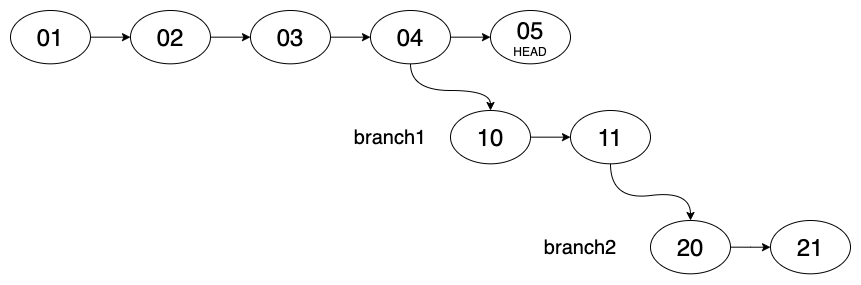

# Learn "git rebase -i" with this lab/playground

Want to learn how to **properly** use `git rebase -i` (also known as an interactive rebase) without putting your production
repo at risk?  You're in the right place!  The script included in this repo will create
a git repo (with 2 cloned copies) that has synthetic checkins and branches.  It makes
for an ideal testing ground to experiment with `git rebase -i` without going insane.

## Getting Started

- Clone this repo: `git clone git@github.com:dmuth/git-rebase-i-playground.git`
- `cd git-rebase-i-playground`
- `./init.sh` - Stand up a set of Git repos with some nested branches
- `./init-with-feature-branches.sh` - Stand up a set of Git repos with multiple feature branches
- `./git-config.sh`
  - Run this to set the following aliases: `st`, `ci`, `co`, and `lg`.  These will make for less typing and easier viewing of logs.

This will create the following repo and directories, each with about a dozen commits:
- `dev-1alice` - A clone of the repo made by "Alice", with two branches: `branch1` and `branch2`.  `branch1` is a branch from main while `branch2` is based on `branch1`.  That is by design (and is based on a True Story, heh).
- `dev-2bob`- A clone of the repo made by Alice's co-worker "Bob", only containing `main`.
- `repo.git` - A "bare" clone of the repo.  Note that if you `cd` to this directory, commands like `git log --pretty=oneline` will work just fine. That is useful for debugging.

NOTE: Running `init.sh` will remove those directories if they already exist.  This is so that you can have a "clean slate" every time you run the script.

The tree looks like this:

## Why would you want to use `git rebase -i`?

Running `git rebase -i commit_id` will bring up recent commits in the system editor and allow
you to reorder the commits, edit the commit message, or even delete commits.

Why would you want to delete a commit?  Probably the most common reason is that you made many commits
to a feature branch that you would like to squash into a single commit. 
Or perhaps you made a feature branch based on another branch, and want to deploy the changes 
from that feature branch but not the branch it's based on. (Happened to me once!)

### Any caveats?

Anytime you rebase, you are *rewriting history*.  If you changes have already been pushed, you will
need to push them again, and history will be overwritten.  If other users have already checked out
the branch in question, this will cause a merge on their end, which will (eventually) wind up on 
the server's repo, and in your repo.  It will make the commit history just slightly uglier.

## Exercises

Once that you have the repos set up, here are some sample exercises to try (answers below) in `dev1-alice`:

- Switch the order of commits `04-fourth` and `05-fifth`
- Merge the changes of `branch2` into `main` but NOT the changes of `branch1`
- Squash the two commits in `branch1` then push to `origin`
- Switch the order of commits `04-fourth and 05-fifth`, push to `origin`
- Switch the order of commits `01-first-will-conflict` and `02-second-will-conflict`, THEN push to `origin`
- Run `git rebase -i` and delete commit `04-fourth`.  Then recover it.
- Switch the order of commits `01-first-will-conflict` and `02-second-will-conflict`

## Hints

Here are some hints to lead you in the right direction but without fully giving away the solution

- Switch the order of commits `04-fourth` and `05-fifth`
   - *Make sure you are going far enough back in the revision history...*
- Merge the changes of `branch2` into `main` but NOT the changes of `branch1`
   - *You'll need to remove some commits...*
- Squash the two commits in `branch1` then push to `origin`
   - *You'll need to overwrite what's already there...*
- Switch the order of commits `04-fourth and 05-fifth`, push to `origin`
   - *There's more than one way to do this*
- Switch the order of commits `01-first-will-conflict` and `02-second-will-conflict`, THEN push to `origin`
   - *You'll need to handle a merge conflict AND overwrite history in the origin...*
- Run `git rebase -i` and delete commit `04-fourth`.  Then recover it.
   - *The commit wasn't technically deleted...*
- Switch the order of commits `01-first-will-conflict` and `02-second-will-conflict`
   - *You're going to have to resolve that merge conflict...*

## Troubleshooting

If things go wrong, here are some suggestions:

- First, the nuclear option: `./init.sh` - This will reset your Git repo to the initial state.  Useful for if you've gone down a hole and you just want to start over.
- Running `git status` at any time will not harm you, and will provide you with some useful info and what you need to do next.
- `git rebase --abort` will back out of the current rebase.
- `git log --pretty=oneline --graph` - Will print a listing of commits in the current branch.
- `git log --pretty=oneline --graph --all` - Will print a listing of commits across all branches, and show which branches are based on what commits.
- The `tig` tool available at https://github.com/jonas/tig is super useful for browsing the commit history of a branch

## Solutions

<a href="SOLUTIONS.md">Solutions can be found here.</a>

## FAQ

### Q: What's the story with Alice and Bob?

A: Alice and Bob are used as placeholder names in cryptology, science, and engineering literature: https://en.wikipedia.org/wiki/Alice_and_Bob  I find using the names to be useful because then I don't have to focus on the underlying details _quite_ as much.

## Additional Resources

- https://www.atlassian.com/git/tutorials/rewriting-history/git-rebase
- https://thoughtbot.com/blog/git-interactive-rebase-squash-amend-rewriting-history
- https://git-scm.com/docs/git-rebase
- https://git-scm.com/book/en/v2/Git-Tools-Rewriting-History
- https://www.dmuth.org/howto-safely-use-git-rebase-i/ - My blog post on this topic
- http://gitready.com/advanced/2009/01/17/restoring-lost-commits.html
- http://effectif.com/git/recovering-lost-git-commits
- http://gitready.com/intermediate/2009/02/09/reflog-your-safety-net.html

## TODO

- I want to make some simple/slides graphs that show the state of the Git tree for some of the exercises

## Contact

My email is doug.muth@gmail.com.  I am also <a href="http://twitter.com/dmuth">@dmuth on Twitter</a> 
and <a href="http://facebook.com/dmuth">Facebook</a>!  Additional ways to find me <a href="http://www.dmuth.org/contact">are on my website</a>.

